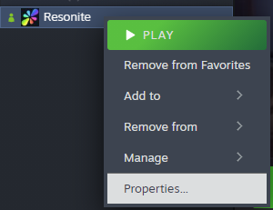
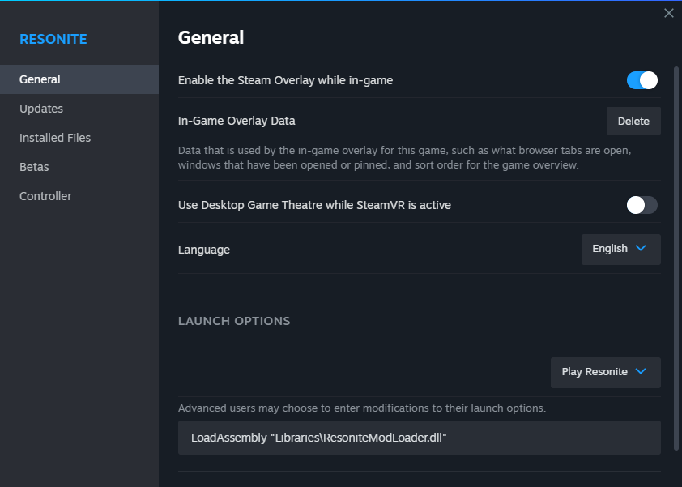

# Launch Options

Adding to your games launch options

1. Go to Steam and find Resonite in your library
2. Right click on Resonite, and go to "Properties"  
   
3. At the bottom of the General tab, you will have a field where you can enter Launch Options.
   
4. Enter in `-LoadAssembly Libraries\ResoniteModLoader.dll`
 - Surrounding the path here with quotation marks `" "` is optional if the relative path is used and doesn't contain spaces
 - If the mod loader is in another location you will need to use an absolute path surrounded by quotation marks

If ResoniteModLoader doesn't appear to be picking up your launch arguments after following those steps, take a look at our [troubleshooting page](doc/troubleshooting.md).